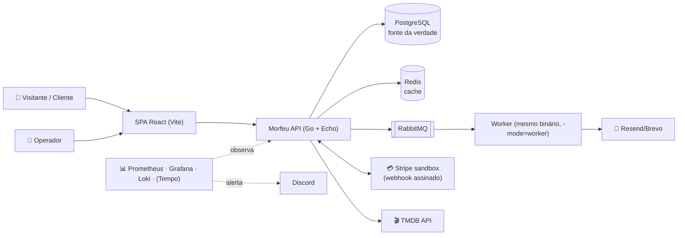
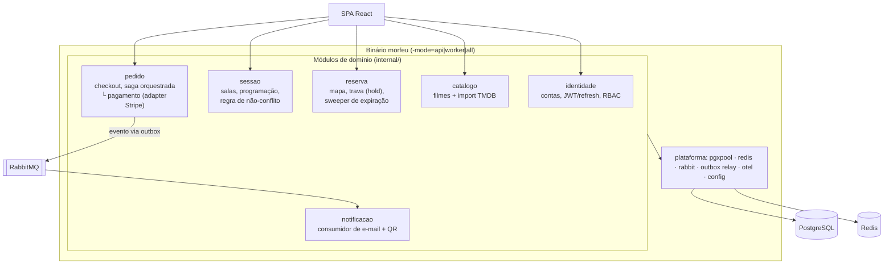
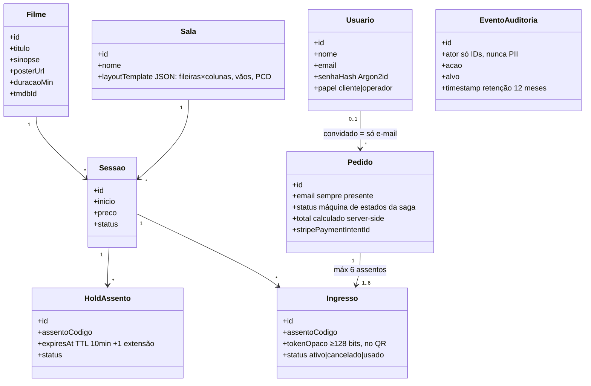
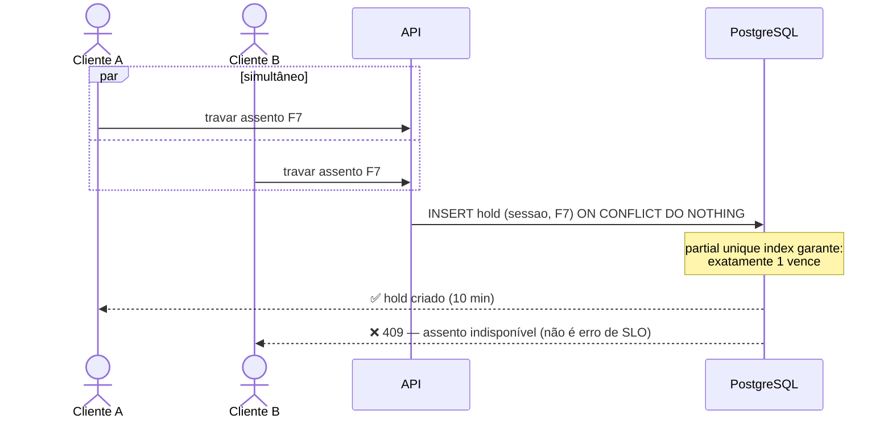

# doc.md — Morfeu

> Mini-UML da aplicação, gerado pela descoberta (`iniciar-projeto`, roles.md §6.15) em 2026-07-06.
> Atualizar sempre que a arquitetura, o domínio ou um fluxo crítico mudar — este arquivo deve refletir o sistema real.

## 1. Visão

Morfeu é um sistema de **venda de ingressos de cinema online** (referência: Ingresso.com/Cinemark) para um único cinema: o visitante consulta o cartaz e as sessões, escolhe o assento num mapa interativo, paga (gateway em sandbox) e recebe o ingresso digital por e-mail; o operador programa filmes, salas e sessões num backoffice mínimo. É um **projeto de portfólio/aprendizado** (dev solo, ~10–12h/semana, sem prazo fixo): o objetivo mensurável é o **MVP deployado e funcionando** em ambiente público, com SLOs comprovados por teste de carga — o produto é o meio; o domínio (concorrência de assentos, saga de pagamento, mensageria, observabilidade) é o fim.

- **Público-alvo:** B2C — consumidores leigos (tráfego real esperado: baixo, típico de portfólio; a volumetria de projeto é validada por teste de carga)
- **Metodologia:** fluxo de governança multiagente (roles.md §2): descoberta → roadmap → task → refinamento → PRD → implementação → auditoria → push → PR → CI/CD

## 2. Atores

| Ator | Tipo | O que faz no sistema |
|---|---|---|
| Visitante | humano | navega cartaz, sessões e mapa de assentos sem conta |
| Cliente | humano | compra ingresso (como convidado com e-mail, ou logado), cancela até 2h antes da sessão, recebe ingresso por e-mail |
| Operador | humano | importa filmes do TMDB, cadastra salas (template JSON), programa sessões e preços; conta criada por seed — nunca auto-registro |
| Stripe (sandbox) | sistema externo | processa pagamento e estorno em modo teste; confirma via webhook assinado |
| TMDB API | sistema externo | fornece título, sinopse, pôster e duração dos filmes (importação pelo operador) |
| Provedor de e-mail | sistema externo | entrega confirmação de compra (com QR/código) e aviso de estorno (free tier Resend/Brevo) |
| Discord | sistema externo | recebe alertas de observabilidade (webhook) |

## 3. Diagrama de contexto



## 4. Componentes

**Monolito modular em Go** (default anti-overengineering, consenso da descoberta): um único binário com flag `-mode=api|worker|all` (um processo no MVP; worker separado só com evidência de teste de carga). Módulos package-by-domain sob `internal/`, com **ownership estrito de tabelas** (nenhum módulo lê tabela alheia); comunicação síncrona por interface Go, assíncrona por evento via **outbox → RabbitMQ**.



- **PostgreSQL é a fonte da verdade** de todo estado transacional — inclusive a trava de assento (partial unique index + `expires_at`); **Redis é só cache** (cartaz e mapa de assentos renderizado, TTL 2–5s ou invalidação por evento).
- **Camada de dados: sqlc + pgx/v5** (SQL explícito, type-safe, custo zero de runtime; pgx puro permitido para SQL dinâmico do backoffice); instrumentação `otelpgx`.
- SPA e API servidas sob o **mesmo domínio** via Caddy (evita CORS permissivo; simplifica cookies).

## 5. Modelo de domínio



Invariante central (fluxo crítico 2): **`UNIQUE (sessao_id, assento_codigo)` parcial por status ativo** — em holds e em ingressos. O banco é a última linha de defesa contra venda dupla; verificável por query.

## 6. Fluxos críticos

### 6.1 Compra completa (saga orquestrada do checkout)

```mermaid
sequenceDiagram
    actor C as Cliente
    participant SPA
    participant API as API (pedido)
    participant PG as PostgreSQL
    participant ST as Stripe sandbox
    participant OB as Outbox→RabbitMQ
    participant WK as Worker (notificacao)
    C->>SPA: escolhe sessão + assentos (máx 6)
    SPA->>API: trava assentos
    API->>PG: INSERT hold ON CONFLICT DO NOTHING (TTL 10min)
    API->>ST: cria PaymentIntent (valor calculado server-side)
    C->>ST: paga (elements/checkout)
    ST-->>API: webhook assinado (verificação + dedup por event-id)
    API->>PG: TX: hold→vendido + emite Ingresso (token opaco) + grava outbox
    OB->>WK: evento pedido-confirmado
    WK->>C: 📧 e-mail com ingresso/QR (retry + DLQ; NUNCA compensa a venda)
```

**Compensações por passo** (definidas antes do passo entrar): falha na cobrança → libera hold; falha na emissão → estorno no gateway + libera hold; falha no e-mail → retry com backoff → DLQ + alerta (passo pós-pivô — a venda permanece válida). Monitoramento da saga: métrica `saga_compensacoes_total{passo}` + trace OTel ponta a ponta (contexto propagado na mensagem RabbitMQ).

### 6.2 Disputa concorrente do mesmo assento



Expiração: lazy (avaliada na leitura por `expires_at`) + sweeper periódico. Restart do Redis não afeta travas (Redis é só cache). Teste canônico: N goroutines + barreira → exatamente 1 sucesso + query de invariante.

### 6.3 Programação sem conflito de sala/horário

Operador cria sessão → o módulo `sessao` valida sobreposição na mesma sala (início/fim + duração do filme via TMDB + intervalo de limpeza — valor definido no refinamento) via constraint/query de intervalo. Conflito → 409 com o horário conflitante; auditoria registra a ação do operador.

## 7. Requisitos não funcionais

| Requisito | Alvo | Origem |
|---|---|---|
| Latência (leituras síncronas: cartaz, mapa) | p95 < 300 ms sob carga-alvo | bloco C + confronto (SLO segmentado) |
| Latência (checkout fim-a-fim: pagamento confirmado → ingresso emitido) | SLI próprio, medido separado (gateway externo excluído do p95 de leitura) | confronto QA |
| Disponibilidade | best effort (healthchecks + restart automático + watchdog externo) | bloco C |
| LGPD | PII mínima (nome/e-mail); cartão nunca toca o backend; sem PII em logs (allowlist no logger); deleção de conta por **pseudonimização** (transacional referencia IDs, nunca PII inline) | bloco C + security |
| Auditabilidade | trilha enxuta: ações do operador + eventos de pedido (append-only, só IDs), retenção 12 meses | confronto (revisão da "auditoria completa") |
| RPO / RTO | 24h / ~1h — pg_dump noturno cifrado → Oracle Object Storage, 7 diários + 4 semanais, restore validado mensalmente | confronto (reversão do "sem backup", 4/4 agentes) |
| i18n / a11y | scaffolding de i18n desde o dia 1 (chaves no front, códigos de erro estáveis na API); tradução EN pós-MVP; a11y básica (semântica, contraste, teclado no mapa) | confronto |

## 8. Volumetria assumida

| Métrica | Estimativa | Confiança |
|---|---|---|
| Usuários ativos simultâneos | 100–1.000 — **alvo simulado via teste de carga** (tráfego real: portfólio, baixo) | declarada |
| Req/s (pico) | alvo de validação: **300 req/s leitura** (número fixo p/ veredito pass/fail; faixa 100–1k explorada no ramp) | declarada (simulada) |
| Perfil leitura×escrita | ~90/10, picos de estreia/fins de semana | assumida (confirmada) |
| Ingressos/dia (cenário simulado) | 1.000–10.000 | declarada (simulada) |
| Crescimento 12m | estável | declarada |
| Retenção | transacional para sempre (pseudonimizável); limpeza operacional (holds expirados, checkouts abandonados, outbox publicada) | declarada |

## 9. Stack e infraestrutura

| Camada | Escolha | Motivo (resumo) |
|---|---|---|
| Backend | Go + Echo v4 | escolha do usuário (aprendizado); Echo validado no Context7 (v4.15.0, ativo) |
| Camada de dados | sqlc + pgx/v5 + pgxpool | SQL explícito (aprendizado de PG real), type-safe, encaixa na saga; consenso arquiteto/backend |
| Banco | PostgreSQL | transacional forte (disputa de assento via constraint), open source |
| Cache | Redis | cache de cartaz/mapa (leitura 90%); **não** guarda estado transacional |
| Mensageria | RabbitMQ | escolha do usuário (aprendizado de mensageria explícito) — ver trade-offs |
| Migrations | golang-migrate v4 | simples, SQL puro, integra com `criar-migration` (§6.10); validado no Context7 |
| Frontend | React + Vite (SPA) | mapa de assentos é UI rica; usuário já domina React |
| Auth | própria: Argon2id + JWT curto (memória) + refresh opaco rotativo (cookie HttpOnly) + RBAC | aprendizado do fundamento; desenho do security é inegociável |
| Infra | VM Oracle Cloud Always Free (4 OCPU ARM/24 GB) — app + PG + Redis + RabbitMQ + observabilidade, limites de memória por container | budget R$ 0; aprendizado de ops puro |
| Dev local | Docker Compose canônico; repo movido para WSL ext4 | I/O nativo (decisão do confronto) |
| CI/CD | GitHub Actions (repo público): lint→vet→test -race→govulncheck→build→GHCR multi-arch (tag=SHA)→deploy SSH (forced command)→smoke | R$ 0 com runner ARM64 grátis; **vetado runner self-hosted** |
| Deploy/rollback | imagem anterior por SHA; migrations expand-contract (§6.10.4) | rollback N-1 compatível com schema N |

Custo mensal estimado: **R$ 0** (Oracle Always Free + conta PAYG com budget alert de $1; GitHub free p/ repo público; TMDB/Resend/Stripe sandbox/Discord free tiers). Condições estruturais do R$ 0: repo público + **modo load-test** no app (adapters fake de gateway/e-mail — Stripe test ~25 req/s e Resend 100 e-mails/dia não aguentam teste de carga).

**Riscos operacionais da plataforma** (registrados): Oracle pode recuperar instância Always Free ociosa (mitigado pelo upgrade PAYG); capacidade ARM A1 escassa ao recriar (mitigado: criar VM na semana 1); sem SLA → princípio **"VM descartável, tudo reconstituível por código"** (compose, dashboards e alertas provisionados por arquivo versionado + backup de dados).

## 10. Trade-offs aceitos

| Decisão | Alternativa descartada | Trade-off aceito | Quem decidiu |
|---|---|---|---|
| RabbitMQ para mensageria | fila sobre Redis (asynq) — recomendação inicial | peça extra de infra p/ operar na VM (watermark absoluto obrigatório); ganho: aprendizado de mensageria explícito | usuário (contra recomendação) |
| Trava de assento no PG; Redis só cache | trava em Redis TTL (escolha inicial do usuário) | perde-se o "lock distribuído em Redis" como exercício; ganha-se correção com 1 fonte de verdade | usuário (aceitou consenso 4/4) |
| Backup diário (reversão do "sem backup") | sem backup | nenhum — custo R$ 0, ~20 linhas | usuário (aceitou consenso 4/4) |
| Trilha de auditoria enxuta | auditoria completa c/ retenção eterna | menos completude forense; ganha-se testabilidade + conformidade LGPD | usuário (aceitou consenso 3/3) |
| Fluxo único convidado+conta | dois fluxos separados | conta vira anexo opcional do pedido; elimina matriz dupla de testes | usuário (aceitou consenso) |
| i18n: scaffolding agora, EN depois | tradução dupla desde já | MVP só pt-BR; retrofit barato garantido pelas chaves | usuário (aceitou consenso) |
| E-mail nunca compensa a venda (pós-pivô) | compensação total por passo | falha de e-mail = retry+DLQ+alerta, venda válida permanece | usuário (aceitou QA) |
| Circuit breaker só no gateway | CB em toda chamada externa | TMDB/e-mail ficam com timeout+retry | usuário (aceitou consenso) |
| Check-in de QR fora do MVP | fluxo completo com validação na entrada | fluxo crítico 1 termina em "ingresso emitido + e-mail entregue"; token já nasce pronto p/ validação futura | usuário (aceitou corte de prazo) |
| Tempo (traces) entra junto com a saga | Tempo desde o dia 1 (posição SRE) | código instrumentado OTel desde o skeleton; servidor de traces só quando houver saga a rastrear | usuário (aceitou backend-dev) |
| Stripe sandbox | Mercado Pago sandbox | menos apelo BR (sem PIX); ganha-se Stripe CLI (webhook local sem túnel) | usuário (aceitou backend-dev) |
| Grafana público com senha forte | túnel SSH apenas | exposição controlada de 1 serviço; demo viva de dashboards p/ portfólio; resto da stack sempre interna | usuário |
| Monolito modular, binário único `-mode` | microserviços / worker separado dia 1 | separação de worker adiada até evidência de carga | consenso agentes |
| k6 fora do gate de PR (nightly/manual) | smoke k6 por PR (posição SRE) | regressão de performance detectada com atraso de até 1 dia | consenso QA + backend-dev |

## 11. Candidatas a ADR

Decisões arquiteturais relevantes identificadas na descoberta — criar apenas com autorização explícita (roles.md §6.1):

- [x] Stack backend Go + Echo → **ADR 0001** (criado 2026-07-07, com autorização)
- [x] Camada de dados: sqlc + pgx/v5 → **ADR 0002** (criado 2026-07-07)
- [ ] Trava de assento: consistência no PostgreSQL (partial unique index + `expires_at` + sweeper); Redis como cache de leitura — criar no refinamento do E4
- [ ] Mensageria: RabbitMQ (trade-off registrado contra fila-sobre-Redis) — criar no refinamento do E0/E6
- [ ] Saga orquestrada do checkout + outbox + idempotência (contrato pedido↔pagamento↔notificação; e-mail pós-pivô) — criar no refinamento do E6
- [x] Fronteiras do monolito modular + binário único `-mode` → **ADR 0003** (criado 2026-07-07)

ADRs de padrão de código criados em 2026-07-07 (confronto multiagente sobre proposta do usuário): **ADR 0004** (padrões de código Go — Object Calisthenics adaptado, erros, TX, naming PT/EN), **ADR 0005** (DDD tático em `pedido`/`reserva` + Strategy/State/Factory idiomáticos), **ADR 0006** (estratégia de testes — pirâmide, bases descartáveis, flaky bloqueante). Índice: `docs/adr/README.md`.

## 12. Integrações e dependências externas

| Integração | Criticidade | SLA/custo | Risco |
|---|---|---|---|
| Stripe (modo teste) | **bloqueia MVP** (única) | free; test mode ~25 req/s | rate limit em carga → modo load-test com fake obrigatório; webhook exige assinatura verificada + dedup |
| TMDB API | média (fallback: cadastro manual) | free não-comercial (~50 req/s); atribuição obrigatória | volume ínfimo (só operador); timeout+retry |
| Resend ou Brevo (e-mail) | média (fallback: ingresso na conta/tela) | free: 100/dia (Resend) ou 300/dia (Brevo) | teste de carga estoura o dia → fake no load-test; exige domínio verificado p/ boa entrega (pendência: domínio) |
| Discord (alertas) | baixa | free | — |
| UptimeRobot / healthchecks.io | baixa (watchdog externo) | free | alerta de VM morta não pode vir da própria VM |

## 13. Observabilidade e resiliência

### Ferramentas

| Sinal | Ferramenta | Custo estimado |
|---|---|---|
| Métricas | Prometheus + Grafana (self-hosted, provisionados por arquivo) | R$ 0 |
| Logs | Loki + **Grafana Alloy** como agente único (Promtail deprecado) | R$ 0 |
| Traces | OTel SDK **desde o dia 1** (sampling 10% + 100% erros); servidor **Tempo entra com a saga** (E6/E10) | R$ 0 |
| Alertas | Grafana Alerting → **Discord** (webhook) + UptimeRobot/healthchecks.io externos | R$ 0 |
| Exporters | node_exporter, cAdvisor, postgres_exporter, redis_exporter, `rabbitmq_prometheus` | R$ 0 |

Regra de cardinalidade: nunca rotular métrica com `seat_id`/`session_id`/`user_id`. Requisições contadas por métrica (histograma), não por log.

### Métricas-chave e SLOs

| Métrica | Tipo | Alvo/SLO |
|---|---|---|
| p95 leituras síncronas (cartaz, mapa, sessões) | técnica (RED) | **< 300 ms @ 300 req/s** (medido server-side no Prometheus) |
| Taxa de erro (5xx + timeouts; **409 de disputa NÃO conta**) | técnica | **< 1%** sob carga-alvo |
| Checkout fim-a-fim (pagamento confirmado → ingresso emitido) | técnica/negócio | SLI próprio (alvo definido no baseline) |
| `ingressos_vendidos_total` (/min) | negócio | queda brusca = incidente |
| `saga_compensacoes_total{passo}` | negócio | disparo = problema no checkout (o "monitoramento da saga") |
| Funil de checkout (`checkout_funil_total{etapa}`) + `travas_expiradas_total` | negócio | abandono por etapa |
| Ocupação por sessão | negócio | visão do operador (métrica, não relatório) |
| `outbox_pendentes` + lag do relay + profundidade DLQ | técnica | crescimento sustentado = alerta |

### Logs

- **Formato:** JSON estruturado com trace/correlation ID em toda requisição (propagado pela mensagem RabbitMQ)
- **Nunca logar:** PII, tokens, credenciais, dados de cartão (roles.md §6.6) — logger com allowlist de campos
- **Agregação e retenção:** Loki, ~14 dias, **retenção por tamanho além de tempo** (disco é o recurso crítico da VM)
- **Dashboards do dia 1:** golden signals da API · USE da VM · PG/Redis/RabbitMQ · funil de negócio (evolui por épico)
- **Alertas:** API down/healthcheck (via watchdog externo) · erro > SLO · DLQ crescendo · **disco > 80% (alerta nº 1)** · saturação de conexões PG · consumidor parado

### Padrões de resiliência adotados

| Padrão | Onde se aplica | Compensação/rollback |
|---|---|---|
| Saga orquestrada | checkout: hold → cobrança → emissão → e-mail | falha na cobrança → libera hold; falha na emissão → estorno + libera hold; e-mail é pós-pivô (retry+DLQ, **nunca** estorna) |
| Timeout + retry backoff | Stripe, TMDB, e-mail | circuit breaker **apenas** no gateway |
| Outbox + DLQ + idempotência | eventos de pedido → RabbitMQ → notificação | relay com publisher confirms; dedup por `message_id` na mesma TX do efeito; `x-delivery-limit`; **comando de replay da DLQ** desenhado junto com a saga; limpeza da tabela outbox |
| Rollback de deploy | imagem N-1 por SHA | exige migrations expand-contract (§6.10.4) em todo PRD de migration |

### Healthchecks

- **Liveness:** processo vivo (sem dependências) — restart pelo orquestrador
- **Readiness:** ping PG + Redis + RabbitMQ (gateway **não** entra — dependência externa não derruba readiness) — tira do tráfego

## 14. Requisitos de segurança do MVP (bloqueantes — parecer security)

1. Webhook Stripe: verificação de assinatura + idempotência por event-id (`UNIQUE`) — sem isso o pagamento é forjável.
2. Preço/total **sempre** recalculados server-side; webhook cruzado contra o valor do pedido persistido.
3. Ingresso: token opaco ≥128 bits no QR (nada decodificável); consulta de convidado exige e-mail + código do pedido **juntos**; link com expiração pós-sessão.
4. Auth: Argon2id (OWASP), access token só em memória no SPA, refresh opaco hasheado com rotação + detecção de reuso (revoga família), rate limit de login por IP+conta (throttle), respostas/timing uniformes (anti-enumeração).
5. Hardening da VM antes do 1º deploy público: só 80/443+22 expostos (NSG Oracle **e** sem `ports:` públicos no compose — `ports:` fura UFW), senhas em PG/Redis/RabbitMQ, Caddy+Let's Encrypt+HSTS, Grafana sem default e com senha forte, Prometheus/Loki/Tempo jamais expostos, SSH só chave, usuário de deploy com forced command.
6. Anti-abuso de inventário: máx 6 assentos/checkout, limite de holds simultâneos por identidade, rate limit no endpoint de trava e na criação de pedido convidado.
7. `govulncheck` no CI; versões mínimas do lib.md respeitadas; secret scanning + push protection no repo público.
8. Fase 2 (não bloqueia): 2FA de operador, CAPTCHA condicional, CSP estrita, containers non-root/read-only, teste automatizado de PII em logs.
